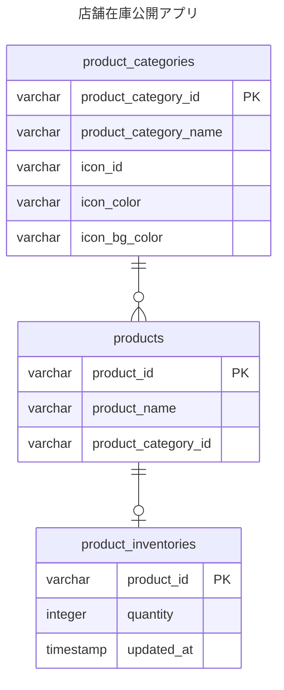

## 概要

本アプリ内で利用するテーブル類について設計する。

## ER 図



## 追加インデックス

- 商品名検索を強化するため、PGroonga を有効化する
- products.product_name にインデックスを付与する
- 参考: https://zenn.dev/circleback/articles/supa-pgroonga
- TODO: チューニング

```sql
DROP INDEX products_product_name_search_index;
CREATE INDEX products_product_name_search_index ON products USING pgroonga (product_name)
  WITH (
   normalizers = 'NormalizerNFKC150(
    "unify_kana", true,
    "unify_kana_case", true,
    "unify_kana_voiced_sound_mark", true,
    "unify_hyphen", true,
    "unify_prolonged_sound_mark", true,
    "unify_hyphen_and_prolonged_sound_mark", true,
    "unify_middle_dot", true,
    "unify_katakana_v_sounds", true,
    "unify_katakana_bu_sound", true,
    "unify_to_romaji", true,
    "unify_katakana_gu_small_sounds", true,
    "unify_katakana_di_sound", true,
    "unify_katakana_wo_sound", true,
    "unify_katakana_zu_small_sounds", true,
    "unify_katakana_du_sound", true,
    "unify_katakana_trailing_o", true,
    "unify_katakana_du_small_sounds", true,
    "unify_kana_prolonged_sound_mark", true,
    "unify_kana_hyphen", true
   )',
   tokenizer='TokenNgram(
    "unify_alphabet", false,
    "unify_symbol", false,
    "unify_digit", false,
    "report_source_location", true
  )'
);
```
